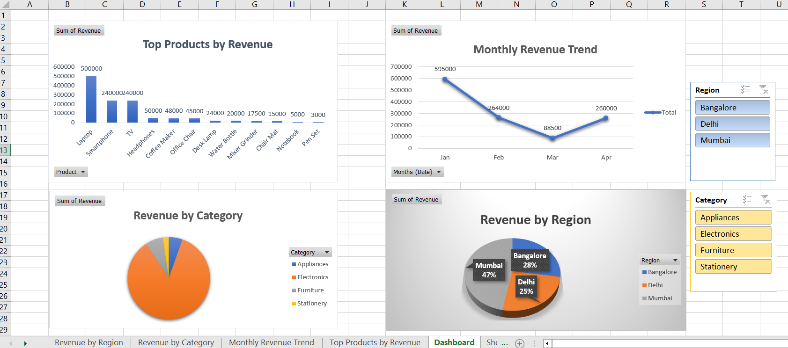

# Excel Sales & Revenue Dashboard

## Dashboard Preview

## Key Insights
- Electronics category contributes the highest revenue.
- Mumbai region shows consistent high sales performance.
- Monthly revenue trend indicates growth in Q1.

## Project Overview
This is a beginner-friendly Excel project created for a Data Analyst role.
The project analyzes sales data and presents insights using an interactive dashboard.

## Tools Used
- Microsoft Excel
- Pivot Tables
- Pivot Charts
- Slicers
- Excel formulas

## Key Analysis
- Revenue by Region
- Revenue by Category
- Monthly Revenue Trend
- Top Selling Products

## Skills Demonstrated
- Data cleaning
- Pivot tables & charts
- Dashboard creation
- Business insights

## File
- Sales_Revenue_Dashboard.xlsx
