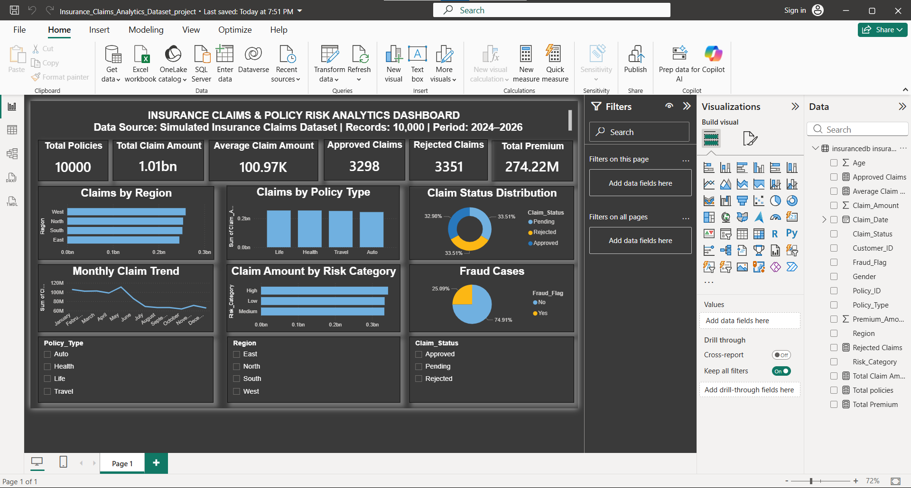

# Insurance Claims & Policy Risk Analytics Dashboard

## 📌 Project Overview

This project analyzes insurance claims data using SQL, Power BI, Excel, and DAX. The dashboard provides insights into claim trends, claim status, policy performance, fraud detection, and risk categories to support business decision-making.

---
## 🛠 Tools Used
- MySQL
- Power BI
- Microsoft Excel
- DAX
---
## 📂 Dataset
- Dataset: Simulated Insurance Claims Dataset
- Records: 10,000
- Period: 2024–2026
---
## 📊 Key Performance Indicators (KPIs)
- Total Policies
- Total Claim Amount
- Average Claim Amount
- Approved Claims
- Rejected Claims
- Total Premium
---
## 📈 Dashboard Visualizations
- Claims by Region
- Claims by Policy Type
- Monthly Claim Trend
- Claim Status Distribution
- Claim Amount by Risk Category
- Fraud Cases Analysis
- Interactive Slicers
---
## 💼 Skills Demonstrated
- Data Cleaning
- SQL
- Power BI Dashboard Development
- DAX Measures
- Data Visualization
- Business Analysis
---
## 📷 Dashboard Preview

---
## 📁 Project Files

- Insurance_Claims_Risk_Analytics.pbix
- Insurance_Claims_Dashboard.png
- Insurance_Claims_Analytics_Dataset.csv
---
## 🚀 Key Business Insights
- Compared claim amounts across different regions.
- Identified the distribution of claims by policy type.
- Analyzed monthly claim trends.
- Compared approved and rejected claims.
- Evaluated claim amounts by risk category.
- Analyzed fraud cases using the Fraud Flag.
