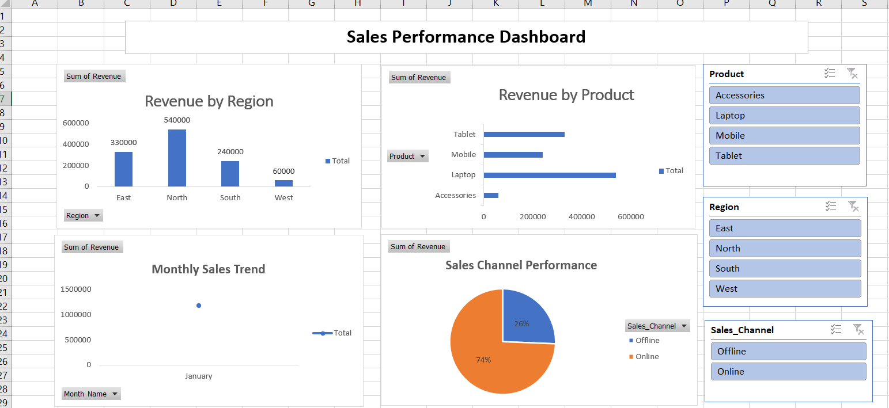

## Sales Performance Dashboard – Excel

### Tools Used
- Microsoft Excel
- Power Query
- Pivot Tables & Charts

### Project Overview
This project analyzes sales performance using Excel and Power Query.
Cleaned and transformed raw sales data using Power Query.
Built an interactive Excel dashboard to analyze sales performance by region, product, month, and sales channel.

## 📊 Dashboard Features
- Revenue analysis by region and product
- Monthly sales trend analysis
- Online vs Offline sales comparison
- Interactive slicers for filtering data

### Key Insights
- Identified top-performing regions and products
- Compared online vs offline sales
- Analyzed monthly revenue trends

### Skills Demonstrated
- Data Cleaning
- Data Transformation
- Excel Dashboards
- Business Analysis
